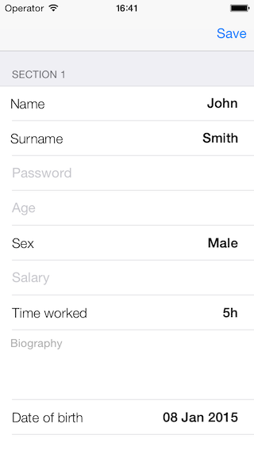
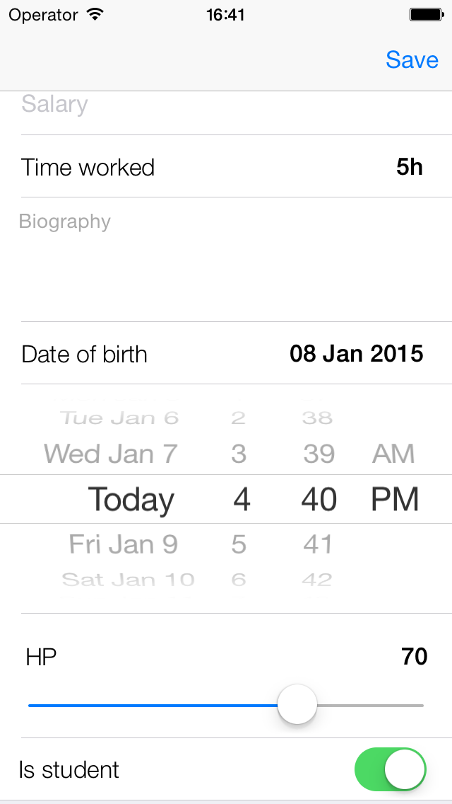

SDForms
=======

## Installation:
1. Drag and drop SDForms.xcodeproj to your project/workspace
2. Add Appriopriate path in Header Search Paths option in Build Settings of your project
3. In Other Linker Flags add "-all_load -ObjC"
4. In Target Dependencies of Build Phases tab add SDForms
5. In Link Binary With Libraries add libSDForms.a
6. In Copy Bundle Resources add SDFormsResourcesBundle.bundle

## Examples:

