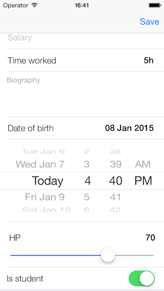

SDForms
=======


SDForms is an open source iOS forms library that allows to create dynamic UITableView-based forms. It offers different types of fields like text fields, picker fields, date picker fields, switch fields, slider fields etc. It also enables to automatically map fields' values to object properties.

## Installation:
1. Drag and drop SDForms.xcodeproj to your project/workspace
2. Add Appriopriate path in Header Search Paths option in Build Settings of your project
3. In Other Linker Flags add "-all_load -ObjC"
4. In Target Dependencies of Build Phases tab add SDForms
5. In Link Binary With Libraries add libSDForms.a
6. In Copy Bundle Resources add SDFormsResourcesBundle.bundle

## CocoaPods

```
pod 'SDForms', :git => 'https://github.com/SnowdogApps/SDForms.git'
```

## Usage

This is only simple example. For more advanced usage please check the sample project.

#### Initializing a form:

```objective-c
self.form = [[SDForm alloc] initWithTableView:self.tableView];
self.form.delegate = self;
self.form.dataSource = self;
```

#### Creating a field:

```objective-c
SDTextFormField *name = [[SDTextFormField alloc] initWithObject:self.person relatedPropertyKey:@"name"];
name.title = @"Name";
name.placeholder = @"Name";
name.cellType = SDTextFormFieldCellTypeTextAndLabel;
```

#### Implementing data source methods;

```objective-c
- (NSInteger)numberOfSectionsForForm:(SDForm *)form
{
return self.sections.count;
}

- (NSInteger)form:(SDForm *)form numberOfFieldsInSection:(NSInteger)section
{
NSMutableArray *fields = [self.sections objectAtIndex:section];
return fields.count;
}

- (SDFormField *)form:(SDForm *)form fieldForRow:(NSInteger)row inSection:(NSInteger)section
{
NSArray *fields = [self.sections objectAtIndex:section];
return [fields objectAtIndex:row];
}
```

## Screenshots:




